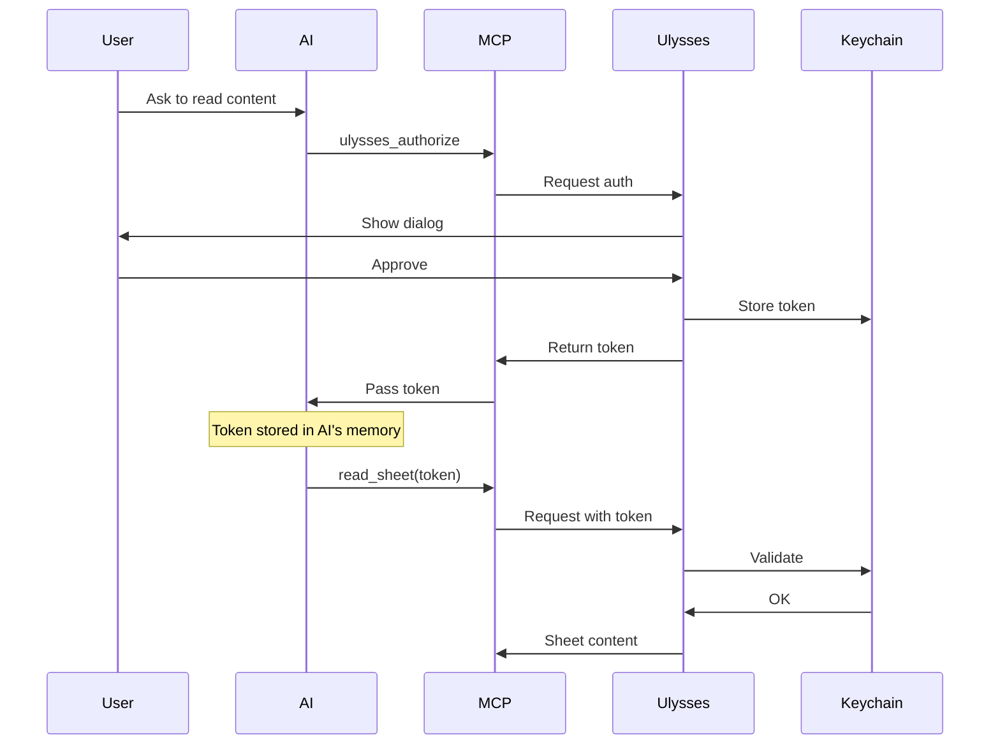
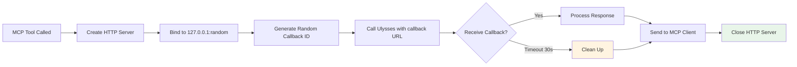

# Security Considerations for Ulysses MCP Server

This document provides additional security guidance specific to the Ulysses MCP Server and its local helper application architecture.

## Overview

The Ulysses MCP Server combines three components that each have security implications:

1. **MCP Server** - Node.js application processing MCP protocol messages
2. **Helper App** - macOS application handling URL callbacks from Ulysses
3. **Ulysses Integration** - x-callback-url based communication

Understanding the security characteristics of this architecture is essential for safe deployment.

## Helper Application Security

### Code Signing Status

⚠️ **The helper app is currently unsigned.**

**Implications:**

- macOS Gatekeeper will block execution on first run
- Users must explicitly allow the app in System Preferences
- No verified developer identity
- May trigger security warnings

**Current Workaround:**

1. After building with `npm run build-helper`, locate the app:

   ```bash
   open helper-app/
   ```

2. Right-click `UlyssesMCPHelper.app` → Open
3. Click "Open" in the security dialog
4. macOS will remember this choice

**Future Improvements:**

For distribution or team use, consider:

- **Self-signing**: Sign with a local certificate for internal use

  ```bash
  codesign -s "Your Identity" helper-app/UlyssesMCPHelper.app
  ```

- **Developer ID**: Sign with an Apple Developer ID for broader distribution

  ```bash
  codesign -s "Developer ID Application: Your Name" helper-app/UlyssesMCPHelper.app
  ```

- **Notarization**: For macOS 10.15+, notarize the app with Apple

  ```bash
  xcrun notarytool submit helper-app/UlyssesMCPHelper.app.zip --apple-id your@email.com
  ```

### Helper App Permissions

**What the helper app can access:**

- ✅ Launch on demand (via URL scheme registration)
- ✅ Receive HTTP requests on localhost
- ✅ Process URL callbacks from Ulysses
- ✅ Network access limited to localhost (127.0.0.1)

**What it CANNOT access without additional permissions:**

- ❌ Your files or documents
- ❌ Other applications
- ❌ System settings
- ❌ Network beyond localhost
- ❌ Keychain (except through Ulysses API)

### URL Scheme Security

The helper app registers the `ulysses-mcp-callback://` URL scheme.

**Security Characteristics:**

- **Unique Scheme**: Prevents conflicts with other apps
- **Unpredictable Callback IDs**: Format: `action-timestamp-random`
- **Single-use**: Each callback ID is used once then discarded
- **Timeout**: Callbacks expire after 30 seconds
- **Localhost Only**: Server binds to 127.0.0.1, not 0.0.0.0

**Potential Risks:**

- ⚠️ Malicious local apps could theoretically invoke the URL scheme
- ⚠️ Callback IDs in URL could be logged by system
- ✅ Mitigated by: Random IDs, short timeouts, single-use design

## MCP Configuration File Security

### Storage Location

MCP configuration files vary by client:

**Claude Desktop:**

```
~/Library/Application Support/Claude/claude_desktop_config.json
```

**Cline:**

```
~/Library/Application Support/Code/User/globalStorage/saoudrizwan.claude-dev/settings/cline_mcp_settings.json
```

### What These Files Contain

```json
{
  "mcpServers": {
    "ulysses": {
      "command": "node",
      "args": ["/path/to/ulysses-mcp/build/index.js"]
    }
  }
}
```

**Security Concerns:**

- ✅ No access tokens stored in MCP config (tokens are in AI assistant's memory)
- ✅ File path to MCP server (not sensitive)
- ⚠️ File permissions should be user-only (600)

### Protection Status

These files are now protected by .gitignore:

```gitignore
**/mcp_settings.json
**/cline_mcp_settings.json
**/*_mcp_settings.json
mcp-config.json
.mcp/
.cline/
```

**Verify Protection:**

```bash
# Check file permissions
ls -la ~/Library/Application\ Support/Claude/claude_desktop_config.json

# Should show: -rw-------  (600)
# If not, fix with:
chmod 600 ~/Library/Application\ Support/Claude/claude_desktop_config.json
```

## Access Token Security

### Token Lifecycle



### Token Storage Locations

| Component | Stores Token? | Where? | Protected? |
|-----------|---------------|--------|------------|
| **Ulysses** | ✅ Yes | macOS Keychain | ✅ Encrypted |
| **MCP Server** | ❌ No | N/A | N/A |
| **AI Assistant** | ⚠️ Maybe | Varies by client | Varies |
| **Your Notes** | ⚠️ Don't! | N/A | N/A |

### Token Exposure Risks

**Low Risk:**

- ✅ Token transmitted over localhost only (not network)
- ✅ Token never written to MCP server logs
- ✅ Token in macOS Keychain (encrypted at rest)
- ✅ Rate limiting prevents abuse

**Medium Risk:**

- ⚠️ Token may persist in AI assistant's conversation history
- ⚠️ Token visible in process arguments (if passed via CLI)
- ⚠️ Token in terminal scrollback if accidentally printed

**High Risk (User Error):**

- 🚨 Committing token to git repository
- 🚨 Sharing screenshots containing tokens
- 🚨 Pasting tokens in public chat/forums
- 🚨 Storing tokens in unencrypted files

### Token Rotation Best Practices

**When to Generate New Tokens:**

1. **Regular Rotation**: Every 90 days (recommended)
2. **After Exposure**: Immediately if token was accidentally shared
3. **Project Change**: When switching AI assistant configurations
4. **Team Change**: If working with different collaborators
5. **Security Concern**: Any suspicion of compromise

**How to Rotate:**

```bash
# 1. Revoke old token in Ulysses
# Ulysses → Preferences → Privacy → Select app → Revoke

# 2. Request new token
# Use ulysses_authorize tool with your AI assistant

# 3. Update any stored references
# (AI assistant should handle this automatically)
```

## AI Assistant Security

### Data Sent to AI Assistants

When you use this MCP server with an AI assistant, the following data flows to the AI:

**Always Sent:**

- Tool invocations (action names, parameters)
- Error messages
- Success confirmations
- Sheet identifiers you reference

**Conditionally Sent:**

- Sheet content (only if you use `read_sheet`)
- Library structure (only if you use `get_root_items`)
- Metadata (titles, keywords, notes - only if accessed)

### Cloud-Based AI Risks

| AI Assistant | Data Location | Retention Policy | Privacy Policy |
|--------------|---------------|------------------|----------------|
| **Claude Desktop** | Anthropic cloud | Per Anthropic policy | [Link](https://www.anthropic.com/privacy) |
| **ChatGPT** | OpenAI cloud | Per OpenAI policy | [Link](https://openai.com/privacy) |
| **GitHub Copilot** | GitHub/Azure | Per Microsoft policy | [Link](https://docs.github.com/en/site-policy/privacy-policies) |
| **Cline + Cloud LLM** | LLM provider | Varies | Check provider |

**Recommendations:**

1. **For Public Content**: Cloud AI is acceptable
2. **For Private Content**: Use local AI only
3. **For Sensitive Content**: Don't use AI at all, or use air-gapped local AI
4. **Review Policies**: Understand your AI provider's data practices

### Local-Only AI Alternatives

**Recommended for Privacy:**

- **Ollama**: Fully local, open source

  ```bash
  brew install ollama
  ollama pull llama2
  # Configure MCP client to use Ollama
  ```

- **LM Studio**: Local LLM with GUI
  - Download from [lmstudio.ai](https://lmstudio.ai)
  - Load models locally
  - No internet required

- **LocalAI**: Docker-based local inference

  ```bash
  docker run -p 8080:8080 quay.io/go-skynet/local-ai:latest
  ```

## Network Security

### Ports and Binding

The MCP server creates temporary HTTP servers for callbacks.

**Default Behavior:**

```javascript
// ✅ SECURE: Binds to localhost only
server.listen(port, '127.0.0.1')

// ❌ INSECURE (never used): Would bind to all interfaces
// server.listen(port, '0.0.0.0')
```

**Port Range:**

- Dynamically allocated by OS (typically 49152-65535)
- Random, unpredictable
- Short-lived (max 30 seconds)
- Automatically cleaned up

**Verify Network Binding:**

```bash
# While MCP server is running and waiting for callback
lsof -i -P -n | grep node

# Should show: 127.0.0.1:XXXXX (LISTEN)
# Should NOT show: *:XXXXX (LISTEN) or 0.0.0.0:XXXXX
```

### Firewall Considerations

**No special firewall rules needed:**

- All communication is localhost (127.0.0.1)
- No inbound connections from network
- No outbound connections to internet
- macOS application firewall doesn't block localhost traffic

**If using Little Snitch or similar:**

- You may see alerts for localhost connections
- Safe to allow `node` → `127.0.0.1` connections
- Safe to allow helper app → `127.0.0.1` connections

## Callback Server Security

### Temporary Server Lifecycle



### Security Properties

**What Makes This Secure:**

1. **Localhost Only**: Servers bind to 127.0.0.1 (not accessible from network)
2. **Random Ports**: OS assigns random high-numbered ports
3. **Unpredictable IDs**: Callback IDs use timestamp + random number
4. **Single Use**: Each callback ID accepted only once
5. **Short Lived**: 30-second maximum lifetime
6. **Automatic Cleanup**: Servers always close after use or timeout
7. **No State**: No persistent data between callbacks

**Attack Scenarios (and Mitigations):**

| Attack | Likelihood | Impact | Mitigation |
|--------|-----------|--------|------------|
| **Local Process Hijack** | Low | High | Localhost binding, random IDs |
| **Callback ID Guessing** | Very Low | Medium | Timestamp + random, single-use |
| **Timeout Exhaustion** | Very Low | Low | 30s limit, automatic cleanup |
| **Replay Attack** | Very Low | None | Single-use IDs |
| **Network Sniffing** | None | N/A | Localhost only (no network traffic) |

## Rate Limiting and DoS Prevention

### Destructive Operation Limits

```javascript
// Rate limit: 10 operations per minute
const RATE_LIMIT = 10;
const RATE_WINDOW = 60000; // 1 minute in ms
```

**Protected Operations:**

- `trash` - Delete items
- `move` - Reorganize items
- `set-group-title` - Rename groups
- `set-sheet-title` - Rename sheets
- `remove-keywords` - Remove metadata
- `update-note` - Modify notes
- `remove-note` - Delete notes

**Why Rate Limiting:**

- Prevents accidental mass deletions
- Limits impact of bugs or errors
- Provides time to notice and stop problematic operations
- Reduces risk of irreversible mistakes

**Bypassing (If Needed):**

If you legitimately need to perform more than 10 destructive operations per minute:

```typescript
// Edit src/index.ts
const RATE_LIMIT = 50; // Increase limit

// Rebuild
npm run build
```

⚠️ **Warning**: Higher limits increase risk of accidental damage. Use with caution.

## macOS Security Integration

### System Permissions

**What macOS Permissions Are Needed:**

- ❌ **Not Needed**: Accessibility
- ❌ **Not Needed**: Full Disk Access
- ❌ **Not Needed**: Screen Recording
- ❌ **Not Needed**: Automation permissions
- ✅ **May Need**: Permission to run unsigned app (one-time)

**Gatekeeper Interaction:**

First time running helper app:

```bash
# You'll see a dialog: "UlyssesMCPHelper.app can't be opened"
# Solution: System Preferences → Security & Privacy → Open Anyway
```

After first approval, macOS remembers the decision.

### Sandboxing Considerations

**Current Status:**

- MCP server: ❌ Not sandboxed (runs as normal Node.js app)
- Helper app: ❌ Not sandboxed (requires URL scheme registration)

**Implications:**

- Server has same permissions as your user account
- Helper app has same permissions as your user account
- Both can access what you can access
- No additional restrictions beyond standard macOS security

**Future Hardening:**

For enterprise deployment, consider:

1. Run MCP server as limited user account
2. Use macOS sandbox profile for helper app
3. Implement additional input validation
4. Add audit logging
5. Deploy with managed configuration

## Audit and Monitoring

### What Can Be Audited

**Via Ulysses:**

- Authorization events (app granted access)
- Authorization revocations
- API usage (Help → Show Console in Ulysses)

**Via System:**

- Process execution (Console.app)
- Network connections (Little Snitch, lsof)
- File access (fs_usage, OpenSnoop)

### Monitoring Commands

```bash
# Monitor network activity
lsof -i -P -n | grep node

# Monitor process creation
ps aux | grep -E '(node|UlyssesMCP)'

# Watch HTTP traffic (requires sudo)
sudo tcpdump -i lo0 -n port 80 or port 443 or greater 1024

# Monitor file access (requires sudo)
sudo fs_usage -w -f filesys node
```

### Logging Best Practices

**What to Log (If Implementing Custom Logging):**

- ✅ Authorization attempts
- ✅ Rate limit violations
- ✅ Validation failures
- ✅ System errors

**What NEVER to Log:**

- ❌ Access tokens
- ❌ Sheet content
- ❌ User data
- ❌ Full error stacks with sensitive data

## Incident Response

### If Access Token is Compromised

**Immediate Actions:**

1. **Revoke Token**:
   - Open Ulysses
   - Preferences → Privacy
   - Find the application
   - Click "Revoke"

2. **Check for Unauthorized Changes**:
   - Review recent sheet modifications
   - Check for unexpected content
   - Look for moved/deleted items

3. **Generate New Token**:
   - Run `ulysses_authorize` again
   - Approve in Ulysses
   - Update AI assistant

4. **Investigate Cause**:
   - Check git repositories for accidental commits
   - Review shared screenshots
   - Check conversation history

### If Helper App is Compromised

**Symptoms:**

- Unexpected behavior from helper app
- Unauthorized network connections
- Modified helper app binary

**Actions:**

1. **Stop the Process**:

   ```bash
   pkill -9 UlyssesMCPHelper
   ```

2. **Remove the App**:

   ```bash
   rm -rf helper-app/UlyssesMCPHelper.app
   ```

3. **Rebuild from Source**:

   ```bash
   # Verify source code
   git diff helper-app/UlyssesMCPHelper.swift
   
   # Rebuild
   npm run build-helper
   ```

4. **Verify Binary**:

   ```bash
   # Check signature (will be unsigned if built locally)
   codesign -dv helper-app/UlyssesMCPHelper.app
   ```

## Security Checklist

### Pre-Deployment

- [ ] Review source code
- [ ] Verify dependencies with `npm audit`
- [ ] Build helper app from source
- [ ] Set appropriate file permissions
- [ ] Configure .gitignore properly
- [ ] Document access token handling procedures

### Regular Maintenance

- [ ] Rotate access tokens every 90 days
- [ ] Update dependencies monthly
- [ ] Review Ulysses authorized apps list
- [ ] Check for security updates
- [ ] Audit recent AI assistant conversations
- [ ] Verify no tokens in version control

### Incident Response Prep

- [ ] Document token revocation procedure
- [ ] Plan for compromise response
- [ ] Know how to rebuild helper app
- [ ] Have backup of Ulysses library
- [ ] Test recovery procedures
- [ ] Document escalation contacts

## Best Practices Summary

### Do's ✅

- ✅ Build helper app from source
- ✅ Use local AI for sensitive content
- ✅ Rotate access tokens regularly
- ✅ Keep dependencies updated
- ✅ Review authorized applications periodically
- ✅ Use .gitignore to protect config files
- ✅ Monitor network connections
- ✅ Backup your Ulysses library

### Don'ts ❌

- ❌ Commit access tokens to version control
- ❌ Share screenshots with tokens visible
- ❌ Use cloud AI for sensitive content without understanding implications
- ❌ Skip token rotation
- ❌ Ignore security updates
- ❌ Trust binaries without verification
- ❌ Disable rate limiting without good reason
- ❌ Run as root/administrator unnecessarily

## Additional Resources

- **MCP Security Best Practices**: [modelcontextprotocol.io/docs/security](https://modelcontextprotocol.io)
- **Ulysses Privacy Policy**: [ulysses.app/privacy](https://ulysses.app/privacy)
- **macOS Security Guide**: [Apple Platform Security](https://support.apple.com/guide/security/welcome/web)
- **Node.js Security Best Practices**: [nodejs.org/en/docs/guides/security/](https://nodejs.org/en/docs/guides/security/)

## Contact

For security-related questions or concerns:

- **Security Issues**: <sonofagl1tch@pebcakconsulting.com>
- **GitHub Security Advisories**: [Create Advisory](https://github.com/sonofagl1tch/ulysses-mcp/security/advisories/new)
- **General Questions**: [GitHub Issues](https://github.com/sonofagl1tch/ulysses-mcp/issues)

---

**Last Updated**: October 28, 2025  
**Document Version**: 1.0  
**Security Policy Version**: Aligned with v0.1.0
