# Ulysses MCP Server - Architecture Documentation

## Overview

The Ulysses MCP Server is a **local-only bridge** between AI assistants and the Ulysses writing application. It operates entirely on your local machine with **zero external network calls** and **no data collection**.

## System Architecture

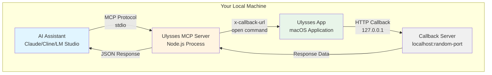

### Components

#### 1. AI Assistant (Client)

- Claude Desktop, Cline (VS Code), LM Studio, or any MCP-compatible client
- Communicates via MCP protocol over stdio (standard input/output)
- Sends tool requests and receives responses
- **No network access required**

#### 2. MCP Server (Bridge)

- Node.js application running locally
- Validates and processes tool requests
- Constructs Ulysses x-callback-url commands
- Manages temporary callback servers
- **All processing happens locally**

#### 3. Callback Server (Temporary HTTP Server)

- Dynamically created HTTP server on localhost
- Random ephemeral port (49152-65535)
- Receives responses from Ulysses
- Automatically closes after receiving callback
- **Only accepts connections from 127.0.0.1**

#### 4. Ulysses Application

- macOS writing application
- Processes x-callback-url commands
- Sends responses via HTTP callbacks
- **No external network communication**

## Communication Flow

### Write Operation (No Callback)

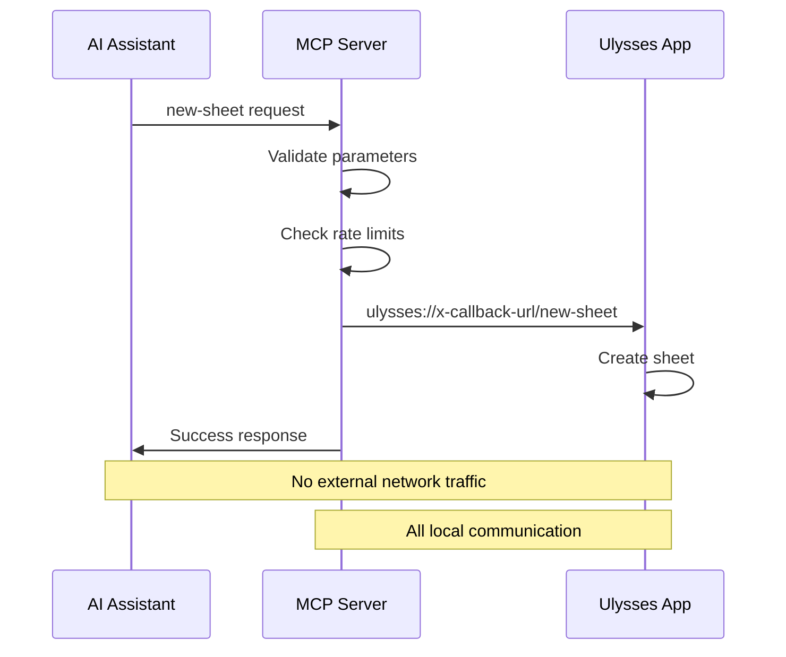

### Read Operation (With Callback)

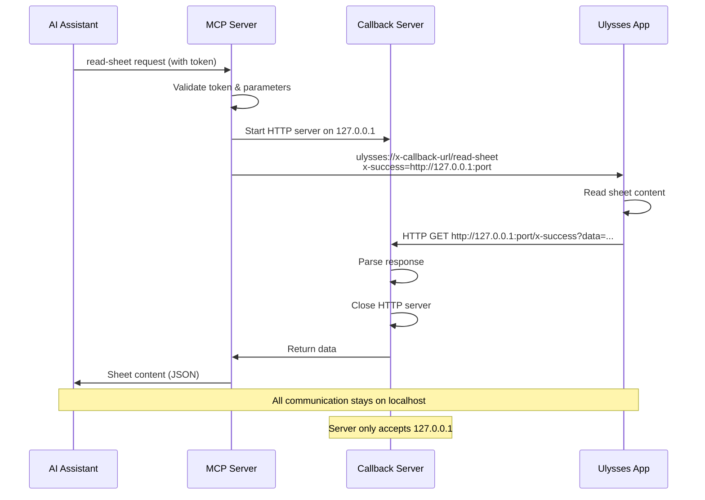

## Data Flow & Privacy

### Data Never Leaves Your Machine

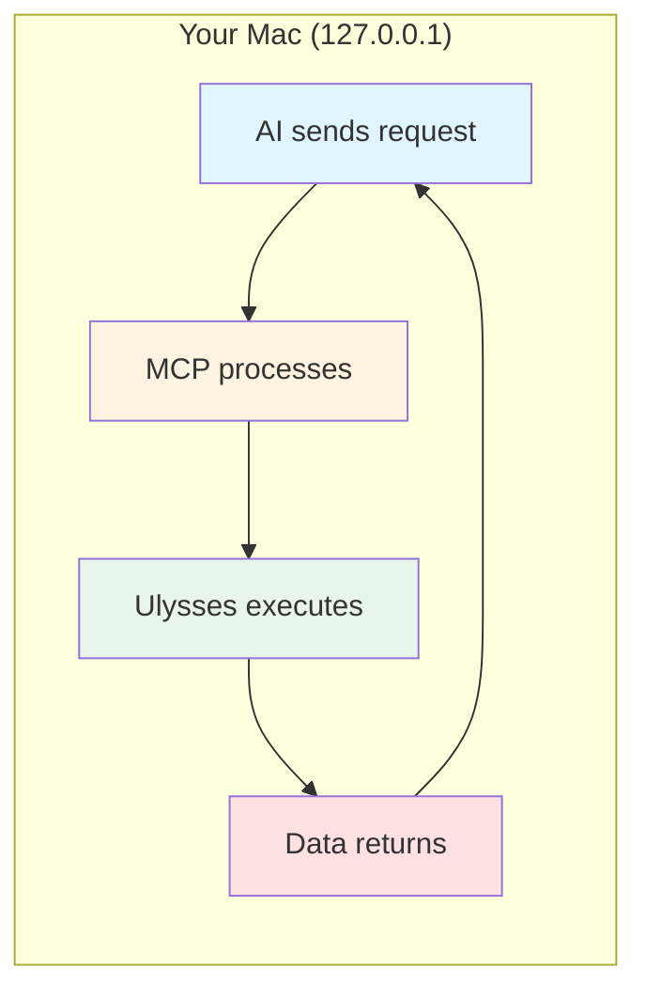

**Privacy Guarantees:**

1. ✅ **No External Network Calls** - All communication is localhost-only
2. ✅ **No Data Collection** - Server doesn't log or store any content
3. ✅ **No Analytics** - No telemetry or tracking
4. ✅ **No Cloud Services** - No AWS, Google, Azure, or any cloud APIs
5. ✅ **No Third-Party Services** - No external dependencies at runtime
6. ✅ **Open Source** - All code is auditable

### What Data Flows Where?

| Data Type | Source | Destination | Network |
|-----------|--------|-------------|---------|
| Tool Requests | AI Assistant | MCP Server | stdio (no network) |
| X-Callback URLs | MCP Server | Ulysses | macOS `open` command |
| Callback Responses | Ulysses | Callback Server | localhost HTTP |
| Tool Responses | MCP Server | AI Assistant | stdio (no network) |
| Access Tokens | User | Ulysses | User's keychain |
| Sheet Content | Ulysses | AI Assistant | Via MCP (local only) |

**Note:** Access tokens are stored by Ulysses in your macOS keychain, not by the MCP server.

## Security Architecture

### Input Validation Layer

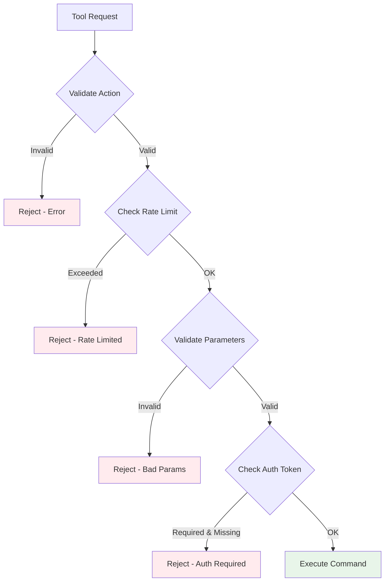

### Security Features

1. **Action Whitelist**
   - Only 23 predefined actions allowed
   - Any other action is rejected
   - Prevents command injection

2. **Command Injection Prevention**

   ```javascript
   // ✅ Safe: Using execFile (not exec)
   await execFileAsync('open', [url]);
   
   // ❌ Unsafe: Never used
   // exec(`open "${url}"`);  // Shell injection risk
   ```

3. **Input Validation**
   - Required parameters checked
   - Enum values validated
   - Length limits enforced (1MB for content, 100KB for notes)
   - Empty values rejected

4. **Rate Limiting**
   - Destructive operations: 10 per minute
   - Prevents accidental mass deletion
   - In-memory tracking (resets on restart)

5. **Callback Security**
   - Random callback IDs
   - 30-second timeout
   - Only accepts connections from 127.0.0.1
   - Automatic cleanup

6. **No Sensitive Data Exposure**
   - Error messages are sanitized
   - Access tokens never logged
   - No debugging output with user data

## Network Topology

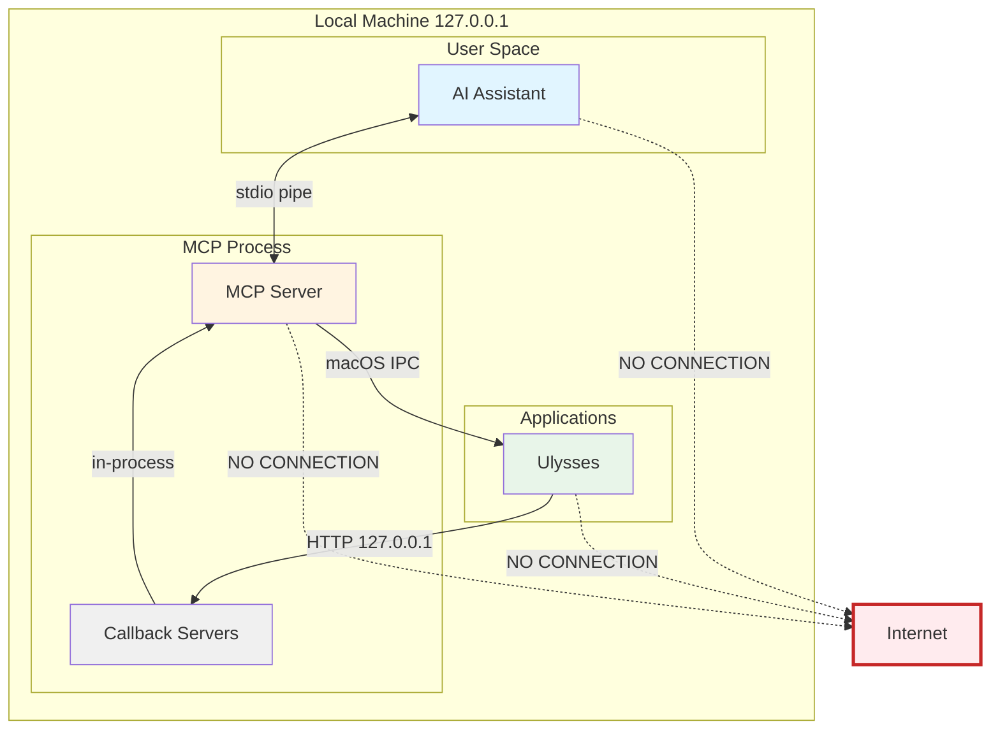

**Key Point:** There are **NO network connections** to the internet. All communication stays within your local machine.

## Process Lifecycle

### Server Startup

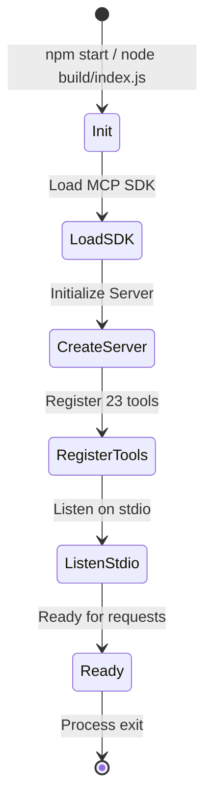

### Tool Execution Lifecycle

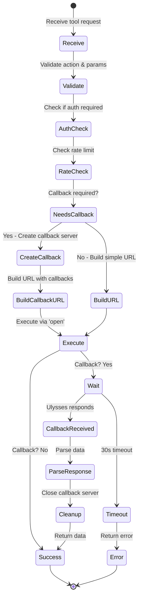

## Transport Mechanisms

### MCP Protocol (stdio)

The Model Context Protocol uses standard input/output streams:

```
┌─────────────┐         stdin          ┌─────────────┐
│             │ ───────────────────>   │             │
│ AI Assistant│                        │  MCP Server │
│             │ <───────────────────   │             │
└─────────────┘         stdout         └─────────────┘
```

**Benefits:**

- Simple and secure
- No network configuration
- Works in sandboxed environments
- Standard Unix pipe mechanism

### Ulysses x-callback-url

Ulysses uses the x-callback-url specification:

```
ulysses://x-callback-url/[action]?
  param1=value1&
  param2=value2&
  x-success=[successURL]&
  x-error=[errorURL]
```

**Flow:**

1. MCP constructs URL with encoded parameters
2. Uses macOS `open` command to send to Ulysses
3. Ulysses processes action
4. Ulysses calls back to success/error URL
5. MCP receives response and parses data

## Deployment Models

### Standalone Mode (Recommended)

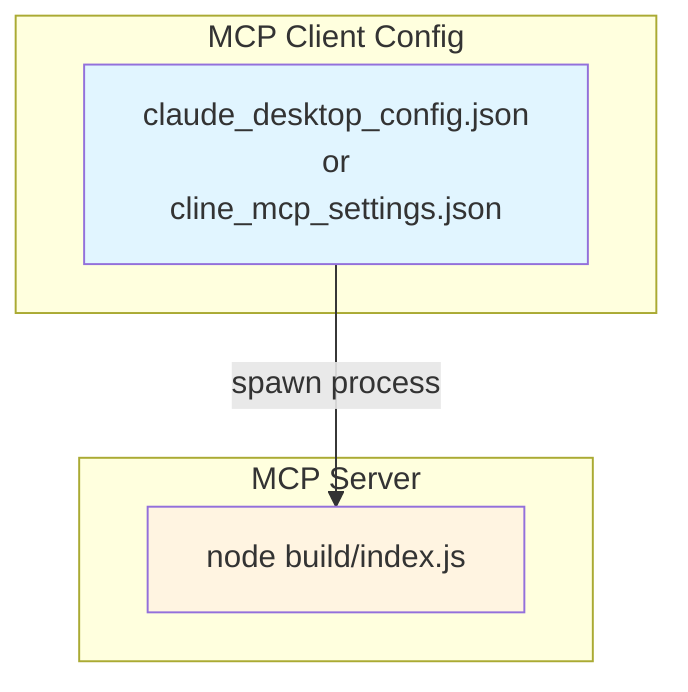

**Configuration Example:**

```json
{
  "mcpServers": {
    "ulysses": {
      "command": "node",
      "args": ["/absolute/path/to/ulysses-mcp/build/index.js"]
    }
  }
}
```

### Development Mode

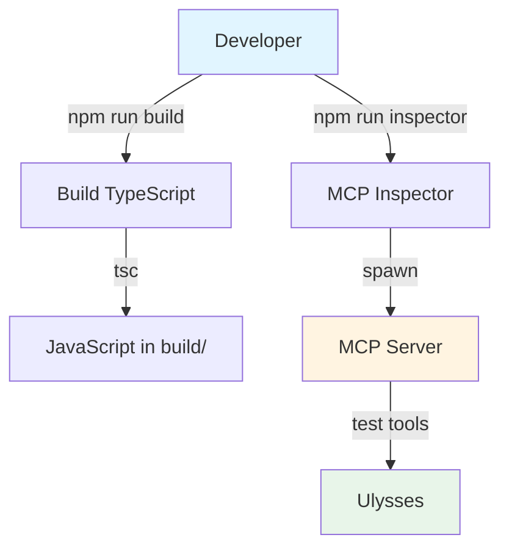

## Performance Characteristics

### Latency Profile

| Operation Type | Typical Latency | Notes |
|----------------|-----------------|-------|
| Write Operations | 100-500ms | No callback, fire-and-forget |
| Read Operations | 500-2000ms | Callback required, includes Ulysses processing |
| Authorization | 2000-10000ms | User must approve in Ulysses |
| Tool Validation | <1ms | Local validation, very fast |

### Resource Usage

- **Memory:** ~50-100 MB (Node.js process)
- **CPU:** Negligible when idle, spikes during operations
- **Disk:** None (no logging or caching)
- **Network:** Zero external connections

### Scalability

- **Concurrent Operations:** Limited by Ulysses processing capacity
- **Rate Limits:** 10 destructive operations per minute
- **Callback Servers:** One per operation requiring callback
- **Maximum Throughput:** ~10-20 operations per minute (practical limit)

## Error Handling

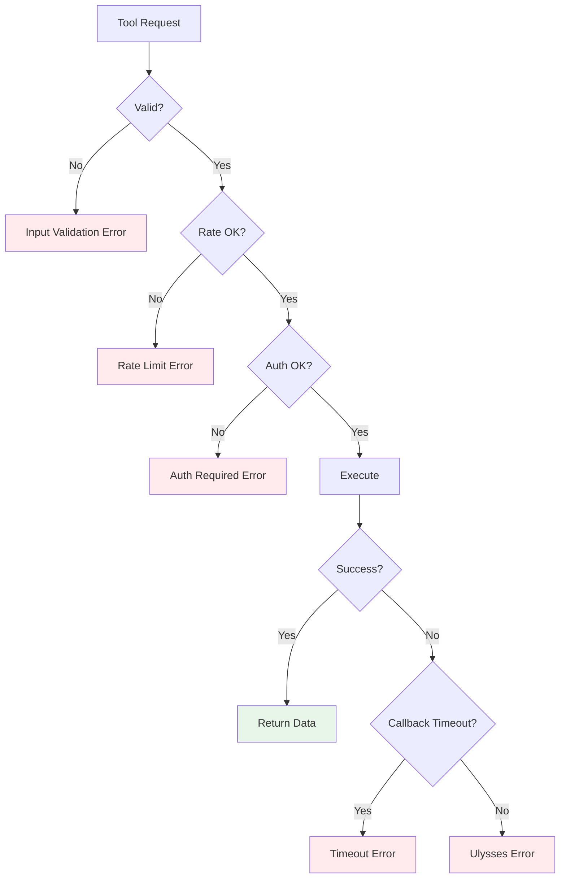

### Error Types

1. **Input Validation Errors** - Invalid parameters, missing required fields
2. **Rate Limit Errors** - Too many destructive operations
3. **Authorization Errors** - Missing or invalid access token
4. **Timeout Errors** - Ulysses didn't respond within 30 seconds
5. **Ulysses Errors** - Ulysses returned an error response

## Monitoring & Observability

**What's Logged:**

- ✅ Server startup/shutdown
- ✅ Callback server creation (port number only)
- ✅ Error types (sanitized)

**What's NOT Logged:**

- ❌ User content or sheet data
- ❌ Access tokens
- ❌ File paths or identifiers
- ❌ Any personally identifiable information

**Debugging:**

- Use `npm run inspector` for interactive testing
- Check MCP client logs for stdio communication issues
- Ulysses Console (Help → Show Console) for x-callback-url issues

## Future Architecture Considerations

### Potential Enhancements

1. **WebSocket Support** (if MCP adds it)
2. **Batch Operations** (multiple operations in one request)
3. **Caching Layer** (for frequently read sheets)
4. **Enhanced Rate Limiting** (per-operation type)

### What Will NOT Change

- ✅ Local-only operation
- ✅ No external network calls
- ✅ No data collection
- ✅ Open source transparency
- ✅ User privacy and security first

---

**Last Updated:** October 2025  
**Version:** 0.1.0
