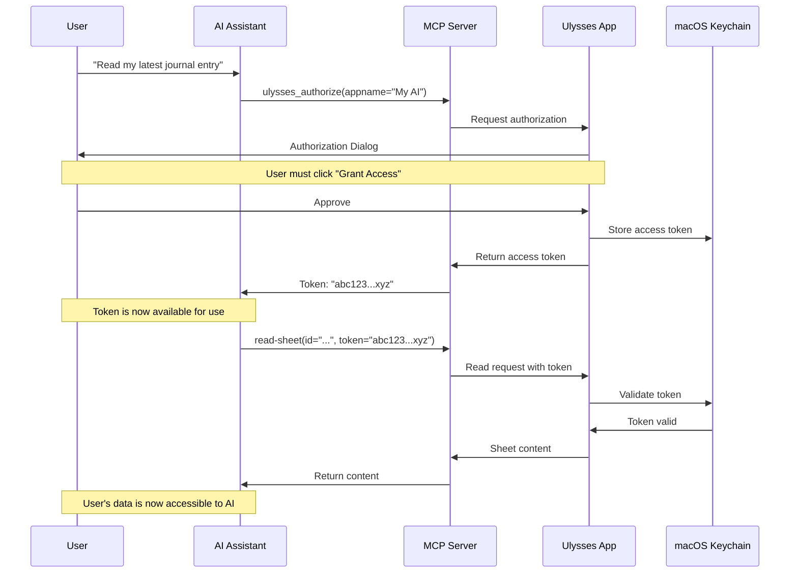
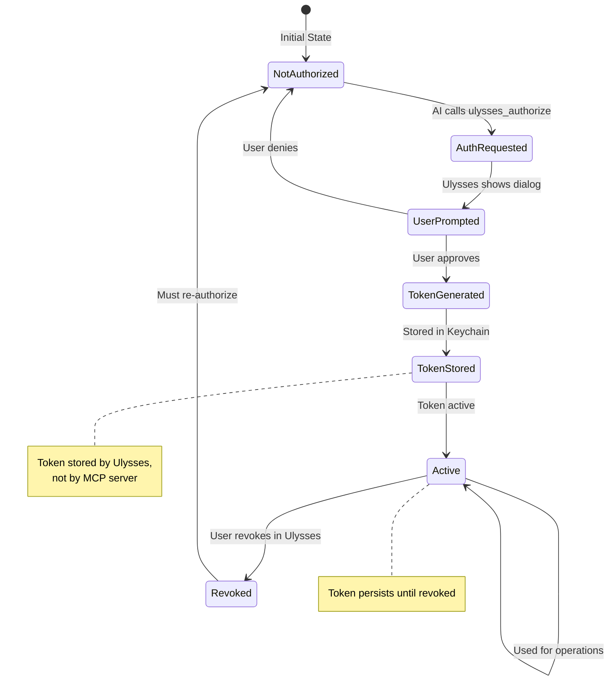
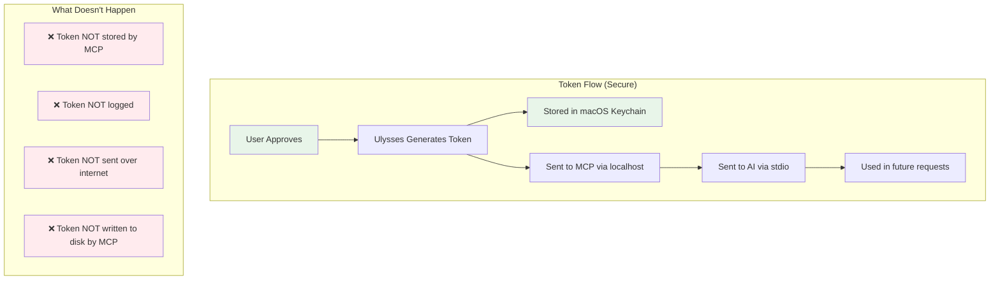
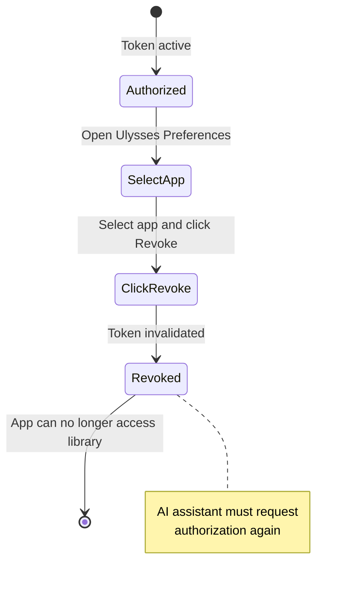
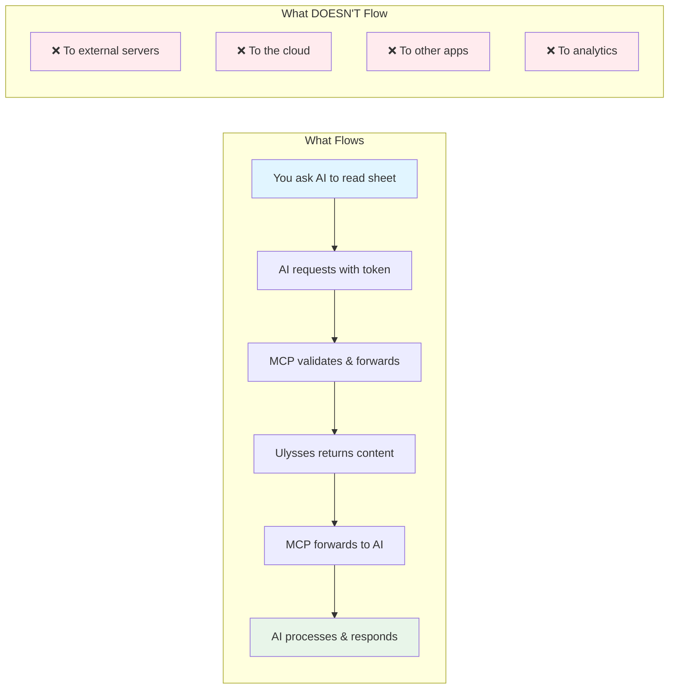

# Ulysses MCP Server - Authentication & Authorization

## Overview

The Ulysses MCP Server uses a **user-controlled authorization model** where you explicitly grant access to your Ulysses library. This document explains how authentication works, what data is accessed, and how to maintain control over your content.

## Authorization Flow



## Understanding Access Tokens

### What is an Access Token?

An access token is a long string (similar to a password) that grants read and write access to your Ulysses library. It looks like:

```
demotoken-kSZp3Jlk2ld82ls02nS9snKLs02nZla023ll2
```

### Token Lifecycle



### Token Characteristics

- **Lifetime:** Indefinite (until manually revoked)
- **Scope:** Full read/write access to Ulysses library
- **Storage:** macOS Keychain (managed by Ulysses)
- **Transmission:** Only over localhost (127.0.0.1)
- **Not Logged:** MCP server never logs or stores tokens

## Authorization Levels

### Operations That DON'T Require Authorization

These operations can be performed without an access token:

| Operation | Description | Security Impact |
|-----------|-------------|-----------------|
| `new-sheet` | Create new sheets | Creates content (low risk) |
| `new-group` | Create groups/folders | Organizes content (low risk) |
| `insert` | Add text to existing sheets | Modifies content (medium risk) |
| `attach-note` | Add notes | Adds metadata (low risk) |
| `attach-keywords` | Add keywords/tags | Adds metadata (low risk) |
| `attach-image` | Add images | Adds content (low risk) |
| `open` | Open sheets/groups | Navigation only (no risk) |
| `open-all` | Open "All" view | Navigation only (no risk) |
| `open-recent` | Open recent view | Navigation only (no risk) |
| `open-favorites` | Open favorites | Navigation only (no risk) |
| `get-version` | Get app version | Information only (no risk) |
| `copy` | Copy sheets/groups | Duplicates content (low risk) |

**Why No Auth Required?** These operations either:

1. Only create new content
2. Only add to existing content
3. Are read-only navigation
4. Are low-risk modifications

### Operations That REQUIRE Authorization

These operations need an access token because they can read or destructively modify content:

| Operation | Description | Why Auth Required |
|-----------|-------------|-------------------|
| `read-sheet` | Read sheet content | **Privacy:** Accesses your writing |
| `get-item` | Get sheet/group info | **Privacy:** Lists your content |
| `get-root-items` | Get library structure | **Privacy:** Full library access |
| `move` | Move sheets/groups | **Destructive:** Can reorganize library |
| `trash` | Delete sheets/groups | **Destructive:** Can delete content |
| `set-group-title` | Rename groups | **Destructive:** Modifies structure |
| `set-sheet-title` | Change sheet titles | **Destructive:** Modifies content |
| `remove-keywords` | Remove tags | **Destructive:** Removes metadata |
| `update-note` | Modify notes | **Destructive:** Modifies metadata |
| `remove-note` | Delete notes | **Destructive:** Removes metadata |

**Why Auth Required?** These operations either:

1. Read sensitive content (privacy concern)
2. Delete or destructively modify content (data loss risk)
3. Reorganize library structure (organization risk)

## Authorization Workflow

### Step 1: Request Authorization

The AI assistant requests authorization:

```json
{
  "tool": "ulysses_authorize",
  "arguments": {
    "appname": "Cline MCP"
  }
}
```

The `appname` parameter appears in the Ulysses authorization dialog, helping you identify which application is requesting access.

### Step 2: User Approval

Ulysses displays a dialog:

```
┌──────────────────────────────────────────┐
│  Ulysses Authorization Request           │
├──────────────────────────────────────────┤
│                                          │
│  "Cline MCP" is requesting access to    │
│  your Ulysses library.                   │
│                                          │
│  This will allow the application to:    │
│  • Read all sheets and groups            │
│  • Create, modify, and delete content    │
│  • Access all metadata                   │
│                                          │
│  [Deny]              [Grant Access]      │
│                                          │
└──────────────────────────────────────────┘
```

**Important:** You must explicitly click "Grant Access" for authorization to succeed.

### Step 3: Token Generation

If you approve:

1. Ulysses generates a unique access token
2. Token is stored in your macOS Keychain
3. Token is returned to the MCP server
4. MCP server returns token to AI assistant

### Step 4: Token Usage

The AI assistant includes the token in subsequent requests:

```json
{
  "tool": "ulysses_read_sheet",
  "arguments": {
    "id": "H8zLAmc1I0njH-0Ql-3YGQ",
    "text": "YES",
    "access_token": "demotoken-kSZp3Jlk2ld82ls02nS9snKLs02nZla023ll2"
  }
}
```

## Security Implications

### What Access Tokens Grant

With an access token, an application can:

✅ **Read Operations:**

- Read all sheet content
- Read all notes and metadata
- List all groups and sheets
- Access your entire library structure

✅ **Write Operations:**

- Create new content
- Modify existing content
- Delete content
- Reorganize library structure

⚠️ **Full Access:** A token grants complete access to your Ulysses library, equivalent to what you can do manually.

### What Access Tokens DON'T Grant

❌ **Cannot:**

- Access other applications or files
- Connect to the internet
- Access your file system outside Ulysses
- Access other user accounts
- Modify Ulysses application settings
- Bypass macOS security permissions

### Token Storage & Transmission



**Key Security Points:**

1. **Keychain Storage:** Tokens are stored by Ulysses in the macOS Keychain, which is encrypted and protected by your system password.

2. **No MCP Storage:** The MCP server never stores tokens to disk. They only exist in memory during operations.

3. **Localhost Only:** Tokens are only transmitted over localhost (127.0.0.1), never over the internet.

4. **stdio Transport:** Communication between AI and MCP uses stdio (pipes), not network sockets.

5. **No Logging:** Tokens are explicitly excluded from any error logs or debugging output.

## Managing Authorization

### Viewing Authorized Applications

To see which applications have access to your Ulysses library:

1. Open Ulysses
2. Go to **Ulysses** → **Preferences** → **Privacy**
3. See list of authorized applications

### Revoking Access

To revoke an application's access:

1. Open Ulysses Preferences → Privacy
2. Find the application in the list
3. Click the **Revoke** button



**Effect of Revoking:**

- Token becomes immediately invalid
- AI assistant cannot access library
- Must re-authorize to regain access
- No data is lost or modified

### Re-Authorization

If you revoke access, the AI assistant can request authorization again by calling `ulysses_authorize`. You'll see the same authorization dialog and can choose to approve or deny.

## Privacy Considerations

### What the MCP Server Sees

The MCP server has access to:

✅ **During Operations:**

- Command parameters (sheet IDs, text content, etc.)
- Callback responses (sheet content, metadata)
- Access tokens (in memory only)

❌ **Never Stores:**

- Sheet content
- Access tokens
- Personal data
- File paths or identifiers

### What the AI Assistant Sees

The AI assistant receives:

✅ **If Authorized:**

- Sheet content you explicitly ask it to read
- Library structure if you ask for it
- Metadata (titles, keywords, notes)

❌ **Without Authorization:**

- Cannot read any sheet content
- Cannot list your library
- Cannot see metadata

### Data Flow Transparency



**All data stays local:** Your sheet content never leaves your machine. It flows from Ulysses → MCP → AI Assistant, all within your local system.

## Best Practices

### Token Management

1. **Unique App Names:** Use descriptive app names when authorizing (e.g., "Claude Desktop" vs "Cline VS Code") to easily identify which application has which token.

2. **Regular Review:** Periodically review authorized applications in Ulysses Preferences and revoke access for applications you no longer use.

3. **Immediate Revocation:** If you suspect a token has been compromised, immediately revoke it in Ulysses Preferences.

4. **Don't Share Tokens:** Never share your access token with others or post it publicly (e.g., in screenshots, code examples).

### Authorization Workflow

1. **On-Demand Authorization:** Only authorize when the AI assistant needs to read content. Many operations work without authorization.

2. **Clear Purpose:** Understand why the AI assistant is requesting authorization. The app name should make this clear.

3. **Scope Awareness:** Remember that authorization grants full read/write access, not just to one sheet.

4. **Trust Factor:** Only authorize applications from sources you trust, as they'll have full access to your writing.

## Troubleshooting

### "Authorization Required" Errors

**Symptom:** AI assistant reports "Authorization required" or "Missing access token"

**Causes:**

- Haven't run `ulysses_authorize` yet
- Token was revoked in Ulysses Preferences
- Token expired (rare, but possible after Ulysses updates)

**Solution:**

1. Run `ulysses_authorize` again
2. Approve the authorization request in Ulysses
3. Token will be automatically used in future requests

### Authorization Dialog Doesn't Appear

**Symptom:** Called `ulysses_authorize` but no dialog appears

**Causes:**

- Ulysses isn't running
- Ulysses is in the background
- macOS security restrictions

**Solution:**

1. Ensure Ulysses is installed and running
2. Bring Ulysses to the foreground
3. Check macOS Privacy settings (System Preferences → Security & Privacy)

### "Invalid Token" Errors

**Symptom:** Operations fail with "Invalid token" or "Unauthorized"

**Causes:**

- Token was revoked
- Token expired
- Using wrong token
- Token corrupted during transmission

**Solution:**

1. Request a new token via `ulysses_authorize`
2. Ensure you're using the most recent token
3. Check that token is being passed correctly

## Comparison with Other Authorization Models

### Ulysses MCP vs OAuth 2.0

| Feature | Ulysses MCP | OAuth 2.0 |
|---------|-------------|-----------|
| **Scope** | Full library access | Granular permissions |
| **Expiration** | No expiration | Usually expires |
| **Refresh** | Not needed | Refresh tokens |
| **Revocation** | Via Ulysses Preferences | Via service provider |
| **Internet** | Not required | Usually required |
| **Complexity** | Simple dialog | Multiple redirects |

### Ulysses MCP vs API Keys

| Feature | Ulysses MCP | API Keys |
|---------|-------------|----------|
| **User Control** | User approves each app | Developer-controlled |
| **Visibility** | Clear UI in Ulysses | Often hidden |
| **Revocation** | Easy, per-app | May affect all apps |
| **Creation** | User-initiated | Developer creates |
| **Privacy** | Local only | Often cloud-based |

## Security Auditing

### What You Can Audit

1. **Authorized Applications:** Check Ulysses Preferences → Privacy to see which apps have access

2. **Operation History:** Ulysses doesn't log operations, but you can use Time Machine to recover deleted content

3. **Network Traffic:** Use tools like Little Snitch to verify no internet traffic (there should be none)

4. **Source Code:** Review the open-source MCP server code to verify security claims

### What Ulysses Logs

Ulysses may log:

- Authorization events (app name, timestamp)
- API calls (action type, timestamp)
- Errors and failures

Ulysses does NOT log:

- Sheet content
- Access tokens
- Personal data

Check Ulysses Console (Help → Show Console) for developer information.

## Frequently Asked Questions

### Q: Does the MCP server store my access token?

**A:** No. The MCP server never writes the token to disk. It only exists in memory during operations and is passed to the AI assistant, which may choose to store it for future use.

### Q: Can someone steal my token by monitoring my network?

**A:** No. The token is only transmitted over localhost (127.0.0.1), which is not visible on your network. Additionally, stdio communication between the AI and MCP doesn't use network sockets at all.

### Q: What happens if I lose my token?

**A:** Simply run `ulysses_authorize` again. You can have multiple tokens from the same application if needed.

### Q: Can I have different access levels for different apps?

**A:** No. Ulysses authorization is all-or-nothing. Each authorized app gets full read/write access. Manage this by only authorizing apps you fully trust.

### Q: How do I know if my token has been used?

**A:** Ulysses doesn't provide an audit trail of token usage. However, you can see which apps are authorized in Preferences → Privacy.

### Q: What if I want to share my AI assistant's configuration with someone?

**A:** Never share your access token. If you share configuration files, ensure tokens are removed first. Each user must authorize independently.

### Q: Can I use the same token across multiple devices?

**A:** No. Tokens are device-specific and tied to your Ulysses installation. Each device needs its own authorization.

---

**Last Updated:** October 2025  
**Version:** 0.1.0
