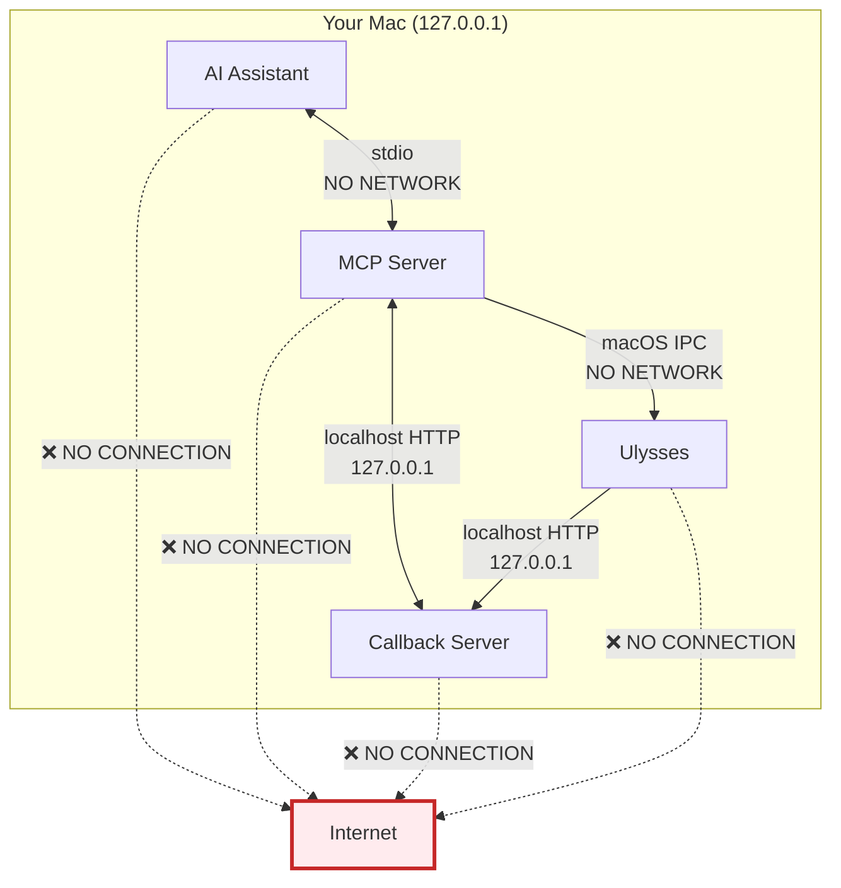
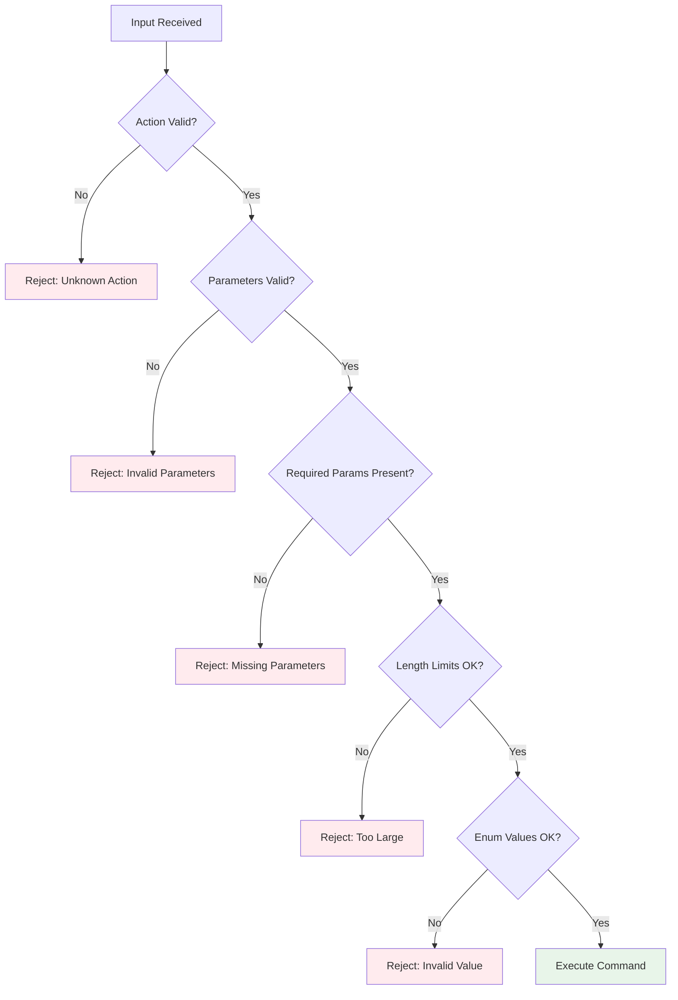
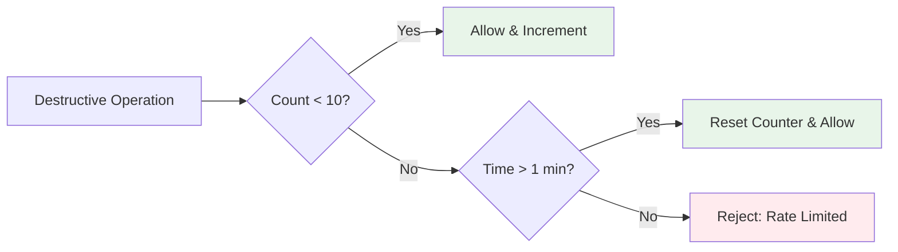
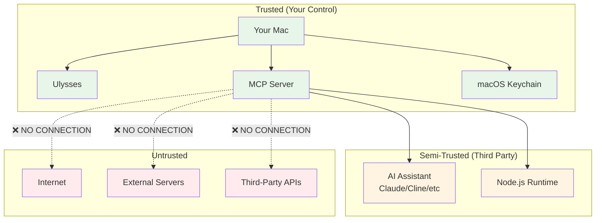

# Ulysses MCP Server - Privacy & Security

## Privacy Statement

The Ulysses MCP Server is designed with **privacy-first principles**. Your writing is personal and valuable, and this tool respects that by ensuring:

✅ **Zero Data Collection** - We don't collect, store, or transmit any of your data  
✅ **Local-Only Operation** - All processing happens on your machine  
✅ **No Analytics** - No tracking, telemetry, or usage statistics  
✅ **No Cloud Services** - No external APIs or cloud dependencies  
✅ **Open Source** - Fully transparent and auditable code  
✅ **User Control** - You explicitly authorize all access  

## What Data is Processed?

### Data That Flows Through the MCP Server

The MCP server processes the following data **temporarily in memory only**:

| Data Type | Purpose | Stored? | Logged? | Transmitted Externally? |
|-----------|---------|---------|---------|------------------------|
| Sheet Content | To create/modify/read sheets | ❌ No | ❌ No | ❌ No |
| Sheet Identifiers | To reference specific sheets | ❌ No | ❌ No | ❌ No |
| Access Tokens | To authorize operations | ❌ No | ❌ No | ❌ No |
| Keywords/Tags | To organize content | ❌ No | ❌ No | ❌ No |
| Notes | To attach metadata | ❌ No | ❌ No | ❌ No |
| Group Names | To organize structure | ❌ No | ❌ No | ❌ No |
| Operation Parameters | To execute commands | ❌ No | ❌ No | ❌ No |

**Key Point:** All data is processed in memory and immediately discarded. Nothing is written to disk, sent to servers, or retained after the operation completes.

### Data That is NEVER Processed

The following data is never accessed or processed by the MCP server:

❌ Your Ulysses preferences or settings  
❌ Files outside your Ulysses library  
❌ Other applications or system files  
❌ Your file system or directories  
❌ Your network traffic or connections  
❌ Your macOS keychain (except Ulysses tokens via Ulysses API)  
❌ Your browsing history or cookies  
❌ Your location data  
❌ Your personal information  
❌ Your device information (beyond what Node.js requires to run)  

## Network Activity

### What Network Connections Are Made?

**Answer: ZERO external network connections.**

The MCP server makes no network connections to the internet. All communication is strictly localhost-only:



### Verifying No External Network Traffic

You can verify this yourself using network monitoring tools:

**Using Little Snitch (macOS):**

1. Install Little Snitch
2. Run the MCP server
3. Observe: No outbound connections from the MCP server process
4. Only localhost (127.0.0.1) connections visible

**Using tcpdump:**

```bash
# Monitor network traffic (requires sudo)
sudo tcpdump -i any host not 127.0.0.1 and not localhost
# Run MCP server operations
# Result: No packets from MCP server to external hosts
```

**Using netstat:**

```bash
# While MCP server is running, check connections
netstat -an | grep ESTABLISHED | grep -v 127.0.0.1
# Result: No connections from MCP server
```

## Data Storage

### What is Stored on Disk?

The MCP server stores **absolutely nothing** on disk related to your Ulysses content:

| Item | Stored? | Location | Encrypted? |
|------|---------|----------|------------|
| Sheet Content | ❌ No | N/A | N/A |
| Access Tokens | ❌ No | N/A | N/A |
| Operation History | ❌ No | N/A | N/A |
| Error Logs | ❌ No* | N/A | N/A |
| User Data | ❌ No | N/A | N/A |
| Configuration | ❌ No | N/A | N/A |

*Error messages may be shown in the terminal but are not persisted to log files. They contain sanitized information only.

### What About Ulysses?

Ulysses stores your content according to its own storage model:

- **iCloud:** Synced and encrypted via Apple's iCloud
- **On My Mac:** Local storage in `~/Library/Group Containers/`
- **External Folders:** Your chosen locations
- **Access Tokens:** macOS Keychain (encrypted by the OS)

The MCP server does not control or modify any of these storage mechanisms.

## Security Features

### 1. Command Injection Prevention

The server uses `execFile` instead of `exec` to prevent shell injection attacks:

```javascript
// ✅ SECURE: Arguments are passed as array
execFile('open', ['ulysses://x-callback-url/...'])

// ❌ INSECURE (never used): String interpolation
// exec(`open "ulysses://x-callback-url/..."`) // Vulnerable!
```

**Why This Matters:** Even if an attacker could somehow inject malicious input, it cannot be executed as a shell command.

### 2. Input Validation

All parameters are validated before processing:



**Validation Rules:**

- Actions must be in the predefined whitelist (23 actions only)
- Required parameters must be present and non-empty
- Enum values must match allowed values
- Content limited to 1MB (sheets) or 100KB (notes)
- Empty values are rejected
- Type checking on all inputs

### 3. Action Whitelist

Only 23 predefined actions are allowed:

```
✅ ALLOWED                    ❌ DENIED
─────────────────────────────────────────
new-sheet                     any-other-action
new-group                     system-command
insert                        file-read
attach-note                   network-request
attach-keywords               arbitrary-url
attach-image                  shell-command
open                          [everything else]
open-all
open-recent
open-favorites
get-version
authorize
read-sheet
get-item
get-root-items
move
copy
trash
set-group-title
set-sheet-title
remove-keywords
update-note
remove-note
```

**Any other action is rejected immediately.**

### 4. Rate Limiting

Destructive operations are rate-limited to prevent accidental mass deletion:



**Protected Operations:**

- trash (delete)
- move
- set-group-title
- set-sheet-title
- remove-keywords
- update-note
- remove-note

**Limit:** 10 operations per minute (resets every 60 seconds)

### 5. Callback Security

Temporary HTTP servers for receiving Ulysses callbacks are secured:

```javascript
// ✅ Only accepts connections from localhost
server.listen(port, '127.0.0.1')

// ✅ Random callback IDs prevent guessing
const callbackId = `${action}-${Date.now()}-${Math.random()}`

// ✅ 30-second timeout prevents hanging
setTimeout(() => cleanup(), 30000)

// ✅ Automatic cleanup after response
server.close()
```

**Security Properties:**

- Binds to 127.0.0.1 only (not accessible from network)
- Random unpredictable callback IDs
- Automatic cleanup and server shutdown
- Short-lived servers (30s maximum)
- No persistent servers

### 6. Error Sanitization

Error messages are sanitized to prevent sensitive data exposure:

```javascript
// ✅ SAFE: Generic error message
throw new McpError(
  ErrorCode.InternalError,
  `MCP error -32603: ${error.message}`
);

// ❌ UNSAFE (never used): Exposing full stack
// throw new Error(JSON.stringify(error))
```

**What's Included in Errors:**

- Error type (validation, timeout, etc.)
- Generic error messages
- Action that failed

**What's NOT Included:**

- Access tokens
- Sheet content
- File paths
- Stack traces with user data
- System information

## Privacy by Design

### Minimal Data Processing

The MCP server follows the principle of **data minimization**:

1. **Only Process What's Needed:** Only the minimum data required for the operation is processed
2. **Immediate Discard:** Data is discarded immediately after processing
3. **No Caching:** No caching layer that could retain data
4. **No Logging:** No persistent logs that could leak data
5. **No Telemetry:** No usage statistics or analytics

### Local-First Architecture

Everything stays on your machine:

```
┌─────────────────────────────────────┐
│  Your Mac                           │
│  ┌───────────────────────────────┐  │
│  │  Your Writing (Ulysses)       │  │
│  └───────────────────────────────┘  │
│            ↕                        │
│  ┌───────────────────────────────┐  │
│  │  MCP Server (Bridge)          │  │
│  └───────────────────────────────┘  │
│            ↕                        │
│  ┌───────────────────────────────┐  │
│  │  AI Assistant                 │  │
│  └───────────────────────────────┘  │
└─────────────────────────────────────┘
         ❌ NO EXTERNAL ACCESS
```

### Open Source Transparency

All code is open source and auditable:

- **Source Code:** Available on GitHub
- **Dependencies:** Listed in package.json
- **Build Process:** Transparent TypeScript → JavaScript compilation
- **No Obfuscation:** Clear, readable code
- **No Hidden Functionality:** What you see is what you get

**Audit It Yourself:**

```bash
# Clone the repository
git clone https://github.com/sonofagl1tch/ulysses-mcp.git
cd ulysses-mcp

# Review the source code
cat src/index.ts  # Main server code

# Check dependencies
cat package.json  # No suspicious packages

# Build from source
npm install
npm run build
```

## Threat Model

### What We Protect Against

✅ **Unauthorized Access:** Authorization model prevents unauthorized data access  
✅ **Data Leakage:** No external network connections prevent data leakage  
✅ **Command Injection:** Input validation and secure command execution  
✅ **Accidental Deletion:** Rate limiting on destructive operations  
✅ **Token Theft:** Tokens only transmitted over localhost  
✅ **Code Injection:** TypeScript and input validation  

### What We DON'T Protect Against

⚠️ **Local Malware:** If your system is compromised, the MCP server cannot protect against local malware with system-level access

⚠️ **AI Assistant Security:** The AI assistant may store data according to its own policies (e.g., Claude, ChatGPT)

⚠️ **Physical Access:** Someone with physical access to your Mac could access running processes

⚠️ **macOS Keychain Compromise:** If your macOS keychain is compromised, access tokens could be stolen

⚠️ **Ulysses Vulnerabilities:** Security vulnerabilities in Ulysses itself are outside our scope

### Trust Boundaries



**Trust Relationships:**

- **Full Trust:** Your Mac, Ulysses, MCP Server, macOS Keychain (all under your control)
- **Conditional Trust:** AI Assistant (may have its own privacy policy), Node.js runtime
- **No Trust:** Internet, external servers, third-party APIs (no connection)

## AI Assistant Privacy

### Important Consideration

While the MCP server is privacy-focused and local-only, **the AI assistant you use may have different privacy characteristics**:

| AI Assistant | Data Policy | Recommendations |
|--------------|-------------|-----------------|
| **Claude Desktop** | May send conversations to Anthropic | Review Anthropic's privacy policy |
| **Cline (Local)** | Local-only if using local LLM | Verify LLM configuration |
| **LM Studio** | Local-only | Ensure no cloud features enabled |
| **OpenAI API** | Sends data to OpenAI | Review OpenAI's data usage policy |
| **Ollama** | Local-only | Safe for sensitive content |

**Recommendations:**

1. **For Sensitive Content:** Use local-only AI assistants (Ollama, LM Studio with local models)
2. **For Cloud AI:** Review the provider's privacy policy and data retention
3. **For Maximum Privacy:** Use local LLMs and disable all cloud features
4. **Regular Review:** Periodically check AI assistant settings and privacy policies

### What the AI Assistant Sees

When authorized, the AI assistant can see:

- Any sheet content you ask it to read
- Library structure if you ask for it
- Metadata (keywords, notes) for sheets you access

**The AI assistant may:**

- Store conversations according to its own policy
- Send data to cloud services (depending on configuration)
- Retain data for training (depending on configuration)

**This is why:**

- Only authorize AI assistants you trust
- Use local-only AI for sensitive content
- Review and understand the AI assistant's privacy policy

## Compliance & Standards

### GDPR Compliance (EU)

The MCP server is GDPR-friendly:

✅ **Data Minimization (Article 5):** Only processes necessary data  
✅ **Purpose Limitation (Article 5):** Data used only for stated purposes  
✅ **Storage Limitation (Article 5):** No data storage beyond operation  
✅ **Integrity & Confidentiality (Article 5):** Secure local processing  
✅ **Accountability (Article 5):** Open source, auditable code  
✅ **Right to Access (Article 15):** Users have full control via Ulysses  
✅ **Right to Erasure (Article 17):** Revoke access tokens anytime  

**Note:** GDPR applies to data controllers/processors. As a user-run local tool, the MCP server doesn't process data on behalf of any organization.

### Privacy Shield / Data Transfers

**Not Applicable:** The MCP server makes no international data transfers because it makes no external data transfers at all.

### Industry Best Practices

✅ **Security by Design:** Security built in from the start  
✅ **Privacy by Default:** No data collection by default  
✅ **Least Privilege:** Only access what's explicitly granted  
✅ **Defense in Depth:** Multiple security layers  
✅ **Fail Secure:** Errors don't expose data  
✅ **Audit Trails:** Authorization events visible in Ulysses  

## Frequently Asked Questions

### Q: Can you see my writing?

**A:** No. We (the developers) cannot see your writing. The MCP server runs entirely on your machine, and no data is sent to us or anyone else.

### Q: Is my writing uploaded to the cloud?

**A:** No. The MCP server never uploads anything to the cloud. All processing is local-only.

### Q: What about the AI assistant (Claude, ChatGPT, etc.)?

**A:** The AI assistant's privacy policy is separate from the MCP server's. Check with your AI provider about their data handling. For maximum privacy, use local-only AI models (Ollama, LM Studio).

### Q: Can I use this offline?

**A:** Yes! The MCP server works completely offline. No internet connection is required or used.

### Q: Is my access token secure?

**A:** Yes, within the local threat model. The token is stored in your macOS Keychain (encrypted) and only transmitted over localhost. However, it grants full access to your Ulysses library, so treat it like a password.

### Q: Do you collect analytics or usage data?

**A:** No. We collect zero analytics, usage data, or telemetry. We don't even know you're using the tool.

### Q: Can you decrypt my data?

**A:** There's nothing to decrypt. We never receive your data in any form. If you sync via iCloud, Apple handles that encryption.

### Q: What if there's a security vulnerability?

**A:** Report it via GitHub Security Advisories. We take security seriously and will issue patches promptly.

### Q: Is this tool audited?

**A:** The code is open source and can be audited by anyone. We encourage security researchers to review it.

### Q: Can my employer see what I write?

**A:** Not through the MCP server. However, standard corporate monitoring (MDM, network monitoring, etc.) is outside our scope.

## Verification & Auditing

### How to Verify Privacy Claims

You can verify our privacy claims yourself:

**1. Review Source Code**

```bash
git clone https://github.com/sonofagl1tch/ulysses-mcp.git
cd ulysses-mcp
grep -r "http://" src/  # No external URLs
grep -r "https://" src/ # No external URLs
```

**2. Monitor Network Traffic**

```bash
# Use Little Snitch, Wireshark, or tcpdump
# You'll see: No external connections
```

**3. Check File System**

```bash
# Run the server
npm run build && node build/index.js

# In another terminal, monitor file writes
sudo fs_usage | grep node

# Result: Only reads from node_modules, no writes to user data
```

**4. Inspect Dependencies**

```bash
npm list
# Review: All dependencies are standard, reputable packages
# No suspicious or unknown packages
```

**5. Build from Source**

```bash
# Don't trust the pre-built version?
# Build it yourself from source!
npm run build
node build/index.js
```

## Contact & Responsible Disclosure

### Security Issues

If you discover a security vulnerability:

1. **DO NOT** open a public GitHub issue
2. Use GitHub Security Advisories (private reporting)
3. Or email: [security contact email]
4. Include:
   - Description of the vulnerability
   - Steps to reproduce
   - Potential impact
   - Suggested fix (if any)

We will:

- Acknowledge receipt within 48 hours
- Investigate and validate the issue
- Develop and test a fix
- Release a security update
- Credit you (if desired) in the security advisory

### Privacy Questions

For privacy-related questions:

- Open a GitHub Discussion
- Or create a GitHub issue (for non-sensitive questions)

---

**Last Updated:** October 2025  
**Version:** 0.1.0  
**License:** MIT  
**Privacy Policy Version:** 1.0
